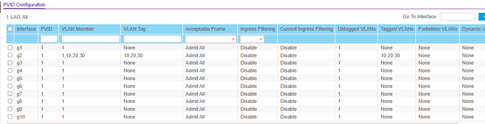
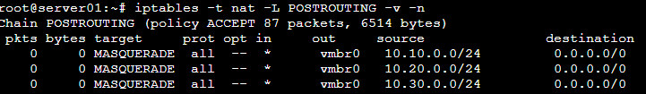
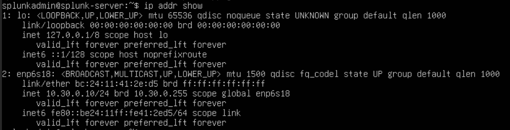
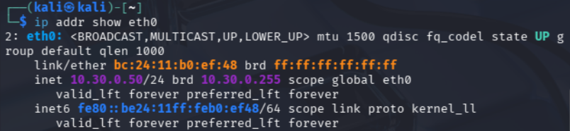
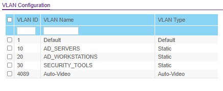

# Lab 00B: Enterprise Network Segmentation with VLANs

## Executive Summary

Upgraded a flat homelab network to a VLAN-segmented architecture using a Netgear GS510TLP managed switch and Proxmox VE. Implemented 802.1Q VLAN tagging to create isolated security zones for Active Directory deployment, security monitoring, and attack simulation - mirroring enterprise SOC environments.

**Duration:** 4 hours | **Role:** Network / Security Engineer | **Tools:** Netgear GS510TLP, Proxmox VE, iptables, Splunk Enterprise

---

## Technical Architecture

### Network Topology


### VLAN Design

| VLAN ID | Name | Subnet | Purpose | Gateway |
|---------|------|--------|---------|---------|
| 1 | MGMT | 192.168.4.0/24 | Proxmox management, production services | 192.168.4.1 |
| 10 | AD_SERVERS | 10.10.0.0/24 | Future Domain Controllers | 10.10.0.1 |
| 20 | AD_WORKSTATIONS | 10.20.0.0/24 | Future domain-joined clients | 10.20.0.1 |
| 30 | SECURITY_TOOLS | 10.30.0.0/24 | Splunk SIEM, monitoring tools | 10.30.0.1 |

### Migration Path

| Component | Before (Lab 00A) | After (Lab 00B) |
|-----------|-------------------|------------------|
| Production Bridge | vmbr0 (192.168.4.0/24) | vmbr0 VLAN-aware (192.168.4.0/24) |
| Lab Network | vmbr1 internal (10.0.0.0/24) | VLAN 30 on vmbr0 (10.30.0.0/24) |
| Splunk Server | 10.0.0.10 on vmbr1 | 10.30.0.10 on VLAN 30 |
| Kali Linux | 10.0.0.50 on vmbr1 | 10.30.0.50 on VLAN 30 |
| Switch Role | Unmanaged patch panel | 802.1Q trunk to Proxmox |
| Isolation Method | Topology (no physical NIC) | VLAN segmentation |

### Switch Port Configuration

| Port | Mode | VLAN 1 | VLANs 10, 20, 30 | Purpose |
|------|------|--------|-------------------|---------|
| 1 | Access | U (Untagged) | - | Uplink to eero router |
| 2 | Trunk | U (Untagged/Native) | T (Tagged) | Proxmox host (nic0) |
| 3-8 | Access | U (Untagged) | - | Available for devices |

---

## Implementation Phases

### Phase 1: Managed Switch Configuration (45 minutes)

**Objective:** Configure 802.1Q VLANs on the Netgear GS510TLP

**Steps Completed:**
1. Factory reset GS510TLP to default configuration
2. Accessed switch via static IP (192.168.0.239)
3. Changed management IP to homelab network (192.168.4.250)
4. Created VLANs 10, 20, and 30 with descriptive names
5. Configured Port 2 as trunk with all VLANs tagged
6. Configured Port 1 as access port for router uplink

**Key Configuration:**
- Web GUI: `Switching > VLAN > 802.1Q > VLAN Configuration`
- Port 2 PVID: 1 (native VLAN)
- Port 2 membership: Tagged in VLANs 1, 10, 20, 30




---

### Phase 2: Proxmox VLAN-Aware Bridging (30 minutes)

**Objective:** Reconfigure Proxmox networking for VLAN tagging

**Steps Completed:**
1. Backed up `/etc/network/interfaces`
2. Enabled VLAN awareness on vmbr0 bridge
3. Created VLAN subinterfaces (vmbr0.10, vmbr0.20, vmbr0.30)
4. Removed obsolete vmbr1 internal bridge
5. Rebooted and verified all interfaces came up

**Configuration Applied:**
```bash
# VLAN-aware bridge
auto vmbr0
iface vmbr0 inet static
    address 192.168.4.X/24
    gateway 192.168.4.1
    bridge-ports nic0
    bridge-vlan-aware yes
    bridge-vids 2-4094

# VLAN subinterfaces as gateways
auto vmbr0.10
iface vmbr0.10 inet static
    address 10.10.0.1/24

auto vmbr0.20
iface vmbr0.20 inet static
    address 10.20.0.1/24

auto vmbr0.30
iface vmbr0.30 inet static
    address 10.30.0.1/24
```

**Verification:**
```bash
ip addr show vmbr0.30  # Shows 10.30.0.1/24
bridge vlan show        # Displays VLAN config on bridge ports
```


---

### Phase 3: Inter-VLAN Routing and NAT (30 minutes)

**Objective:** Enable routing between VLANs and internet access

**Steps Completed:**
1. Enabled IP forwarding persistently via sysctl
2. Configured iptables MASQUERADE for each VLAN subnet
3. Set permissive FORWARD policy (to be hardened in future labs)
4. Installed iptables-persistent to save rules across reboots

**Firewall Configuration:**
```bash
# IP forwarding
sysctl net.ipv4.ip_forward=1

# NAT for each VLAN
iptables -t nat -A POSTROUTING -s 10.10.0.0/24 -o vmbr0 -j MASQUERADE
iptables -t nat -A POSTROUTING -s 10.20.0.0/24 -o vmbr0 -j MASQUERADE
iptables -t nat -A POSTROUTING -s 10.30.0.0/24 -o vmbr0 -j MASQUERADE

# Save rules
netfilter-persistent save
```



---

### Phase 4: VM Migration - Splunk to VLAN 30 (45 minutes)

**Objective:** Migrate Splunk SIEM from flat lab network to dedicated security VLAN

**Steps Completed:**
1. Shut down Splunk VM and created snapshot for rollback
2. Changed VM NIC: vmbr1 → vmbr0 with VLAN tag 30
3. Reconfigured static IP: 10.0.0.10 → 10.30.0.10
4. Updated gateway (10.30.0.1) and DNS settings
5. Verified Splunk services running and web UI accessible

**Migration Commands:**
```bash
# Proxmox host
qm shutdown 100
qm set 100 -net0 virtio,bridge=vmbr0,tag=30,firewall=0
qm start 100

# Inside Splunk VM - updated netplan
# Address: 10.30.0.10/24, Gateway: 10.30.0.1
sudo netplan apply
sudo -u splunk /opt/splunk/bin/splunk status
```

**Validation:**
- Splunk web UI accessible at `http://10.30.0.10:8000`
- Forwarder receiver port 9997 listening
- Internet connectivity confirmed from VLAN 30
- Cross-VLAN gateway pings successful




---

### Phase 5: Kali VM Migration to VLAN 30 (15 minutes)

**Objective:** Migrate Kali Linux from old vmbr1 to VLAN 30 alongside Splunk

Kali runs as a VM on Proxmox (not VirtualBox on main PC), so it can be placed directly on VLAN 30 - no static routes needed. In enterprise SOC environments, attack/analysis tools sit on the same segment as monitoring tools.

**Steps Completed:**
1. Changed Kali VM NIC: vmbr1 → vmbr0 with VLAN tag 30
2. Reconfigured static IP: 10.0.0.50 → 10.30.0.50
3. Verified connectivity to Splunk, other VLAN gateways, and internet
4. Added persistent static routes on Windows PC for browser access to VLANs

**Kali VM Configuration:**
```bash
# IP: 10.30.0.50/24, Gateway: 10.30.0.1
# Can reach Splunk directly (same VLAN)
# Can reach other VLANs via Proxmox inter-VLAN routing
ping -c 3 10.30.0.10  # Splunk - same VLAN
ping -c 3 10.10.0.1   # VLAN 10 gateway - cross-VLAN
```

**Windows PC Static Routes (for browser access):**
```powershell
route add 10.10.0.0 mask 255.255.255.0 192.168.4.10 -p
route add 10.20.0.0 mask 255.255.255.0 192.168.4.10 -p
route add 10.30.0.0 mask 255.255.255.0 192.168.4.10 -p
```



---

### Phase 6: Testing and Validation (30 minutes)

**Objective:** Verify end-to-end VLAN segmentation and connectivity

**Tests Performed:**

1. **Connectivity Matrix** - All VLAN gateways reachable from Proxmox, Kali, and VLAN 30 VMs
2. **VLAN Tag Verification** - tcpdump on nic0 confirmed 802.1Q tags in packet headers
3. **Service Validation** - Splunk web UI, receiver port, and internet access all functional
4. **Network Discovery** - Nmap scan of VLAN 30 discovered gateway and Splunk VM

```bash
# VLAN tag capture
tcpdump -i nic0 -e -c 10 vlan
# Output shows: vlan 30, ethertype IPv4, 10.30.0.10 > 8.8.8.8

# Network discovery from Kali
sudo nmap -sn 10.30.0.0/24
# Discovered: 10.30.0.1 (gateway), 10.30.0.10 (Splunk), 10.30.0.50 (Kali)
```




---

## Key Learnings & Challenges

### Technical Insights

1. **VLAN-aware bridges are superior to multiple bridges** in Proxmox - single bridge with subinterfaces scales better than creating vmbr10, vmbr20, vmbr30 separately
2. **Proxmox acts as a capable router** - no need for a separate pfSense/OPNsense VM for inter-VLAN routing in a homelab
3. **tcpdump on physical interface (nic0), not bridge (vmbr0)** to see actual 802.1Q tags on the wire
4. **Always test incrementally** - verify each VLAN works before moving to the next phase

### Challenges Encountered

1. **VLAN 1 Tagged vs Untagged on Trunk Port**
   - Initially set VLAN 1 as Tagged on the Proxmox trunk port, which broke management access
   - Proxmox couldn't read tagged VLAN 1 frames before VLAN-aware bridging was enabled
   - Fix: VLAN 1 (native/management) must be Untagged on the trunk - only VLANs 10, 20, 30 should be Tagged
   - Lesson: The PVID (Port VLAN ID) setting implies the native VLAN should be untagged

2. **Switch GUI Layout**
   - VLAN configuration is under `Switching > VLAN`, not `Routing > VLAN` (which is Layer 3 routing)

3. **Subnet Accessibility from Main PC**
   - New VLAN subnets (10.x.x.x) not reachable from Windows browser until persistent static routes added
   - Both Kali (on Proxmox) and Windows PC needed separate configuration for access

4. **VM Network Migration**
   - Both Splunk and Kali VMs required migration from deleted vmbr1 to VLAN 30 on vmbr0
   - Kali moved to Proxmox (from VirtualBox) and placed on VLAN 30 alongside Splunk - eliminating need for static routes

### BTL1 Certification Relevance

This lab covers BTL1 exam domains:
- **Network Security Fundamentals (15%):** VLAN configuration, network segmentation, inter-VLAN routing
- **Security Monitoring (10%):** SIEM network placement, monitoring architecture design

---

## Future Enhancements

1. **Firewall Hardening** - Default-deny FORWARD policy with explicit allow rules per VLAN
2. **Active Directory Deployment (Lab 02)** - Domain Controller on VLAN 10, workstations on VLAN 20
3. **Switch Port Mirroring** - Mirror VLAN 10/20 traffic to VLAN 30 for passive monitoring
4. **DNS Server** - Local DNS resolution for all lab hostnames
5. **Intrusion Detection** - Suricata IDS on VLAN 30 integrated with Splunk

---

## Portfolio Highlights

**Demonstrable Skills:**

- Configured enterprise managed switch with 802.1Q VLAN segmentation
- Implemented VLAN-aware bridging and inter-VLAN routing on Linux hypervisor
- Migrated production SIEM infrastructure between network segments with minimal downtime
- Designed network architecture following defense-in-depth principles
- Configured NAT, IP forwarding, and persistent firewall rules with iptables
- Documented implementation with professional technical writing

**Capabilities Unlocked:**
- Active Directory deployment on isolated VLANs (Lab 02)
- Realistic security monitoring across segmented networks
- Attack simulation with lateral movement detection between VLANs
- Network traffic analysis via switch port mirroring

---

## References & Resources

**Official Documentation:**
- [Netgear GS510TLP Support](https://www.netgear.com/support/product/GS510TLP)
- [Proxmox VE Network Configuration](https://pve.proxmox.com/wiki/Network_Configuration)
- [802.1Q VLAN Standard](https://en.wikipedia.org/wiki/IEEE_802.1Q)
- [iptables/Netfilter Documentation](https://www.netfilter.org/documentation/)

**Related Labs:**
- [Lab 00A: Network Foundation Setup](../00_Network_Setup/) - Prerequisite
- [Lab 01: Splunk SIEM Deployment](../01_Splunk_SIEM_Lab/) - Migrated in this lab
- Lab 02: Active Directory Environment - Next lab (enabled by this network)

---

## Project Metadata

**Author:** Harry Miles
**GitHub Repository:** [hazzugot/HomelabRYZEN](https://github.com/hazzugot/HomelabRYZEN)
**Lab Number:** 00B - Network Enhancement with VLAN Segmentation
**Completion Date:** 2026-02-16
**Environment:** Proxmox VE 8.x, Netgear GS510TLP, Ubuntu Server 22.04, Kali Linux
**Total Project Time:** 4 hours

**Tags:** #VLAN #NetworkSegmentation #802.1Q #Proxmox #BlueTeam #BTL1 #Homelab #CybersecurityProjects

---

## Contact & Collaboration

For questions, feedback, or collaboration opportunities:
- **GitHub:** [hazzugot](https://github.com/hazzugot)
- **LinkedIn:** [Harry Miles](https://www.linkedin.com/in/harry-miles-18ab53234)
- **TryHackMe:** [hazmiles11](https://tryhackme.com/p/hazmiles11)

**Open to:**
- Technical reviews and networking feedback
- Collaboration on Blue Team projects
- SOC Analyst / Security Engineer insights and opportunities

---

*This documentation represents real-world, hands-on experience with enterprise network infrastructure and is maintained as part of a professional cybersecurity portfolio.*
