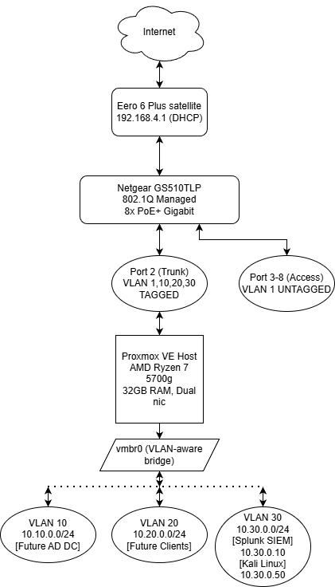
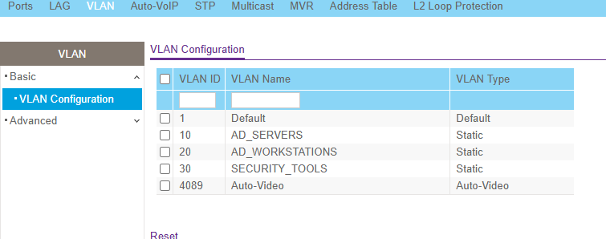
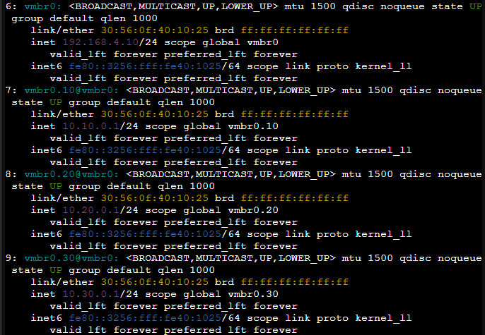
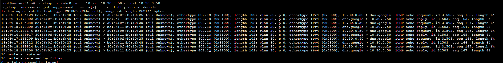
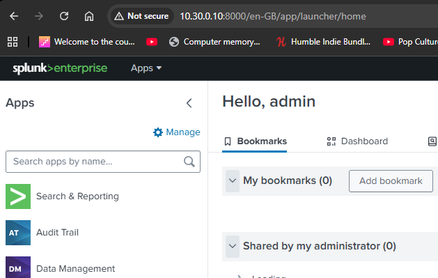
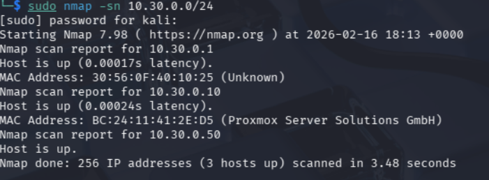

# Lab 00B: Network Segmentation with VLANs

**Status:** Complete | **Difficulty:** Intermediate | **Time:** 4 hours

Upgraded a flat homelab network to enterprise-grade VLAN segmentation using a Netgear GS510TLP managed switch and Proxmox VE VLAN-aware bridging.

---

## Network Architecture

| VLAN | Name | Subnet | Purpose |
|------|------|--------|---------|
| 1 | MGMT | 192.168.4.0/24 | Proxmox management, production services |
| 10 | AD_SERVERS | 10.10.0.0/24 | Future Domain Controllers |
| 20 | AD_WORKSTATIONS | 10.20.0.0/24 | Future domain-joined clients |
| 30 | SECURITY_TOOLS | 10.30.0.0/24 | Splunk SIEM, Kali Linux |

## What Was Done

- Configured 802.1Q VLANs on a managed switch with trunk/access port assignments
- Enabled VLAN-aware bridging on Proxmox with subinterfaces as gateways
- Set up inter-VLAN routing and iptables NAT for internet access
- Migrated Splunk SIEM (10.0.0.10 → 10.30.0.10) and Kali Linux (10.0.0.50 → 10.30.0.50) to VLAN 30
- Verified VLAN tagging with tcpdump and cross-VLAN connectivity with Nmap

## Screenshots

| Phase | Evidence |
|-------|----------|
| Switch VLAN config |  |
| Proxmox VLAN interfaces |  |
| VLAN tags in tcpdump |  |
| Splunk on VLAN 30 |  |
| Nmap scan across VLANs |  |

## Skills Demonstrated

- 802.1Q VLAN configuration on managed switches
- Proxmox VLAN-aware bridge networking
- Inter-VLAN routing and iptables NAT/MASQUERADE
- VM network migration between segments
- Network troubleshooting and packet analysis

## Documentation

- [Full Lab Writeup](GITHUB_WRITEUP.md) - Detailed implementation with portfolio highlights
- [Step-by-Step Guide](README.md) - Complete lab instructions
- [Troubleshooting Guide](TROUBLESHOOTING.md) - Issues encountered and solutions
- [Quick Reference](QUICK_REFERENCE.md) - Command cheat sheet

## Built With

- Netgear GS510TLP 8-Port PoE+ Managed Switch
- Proxmox VE 8.x
- Ubuntu Server 22.04 (Splunk)
- Kali Linux
- iptables / netfilter

---

**Next:** [Lab 02 - Active Directory Deployment](../02_Active_Directory_Lab/) on VLANs 10 and 20
