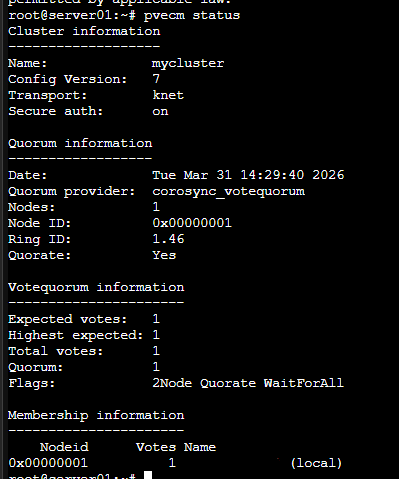
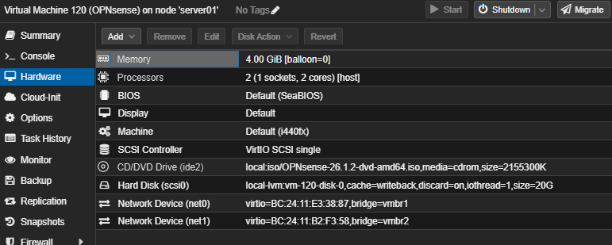
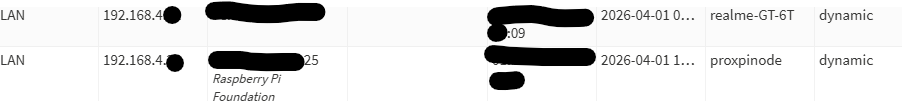
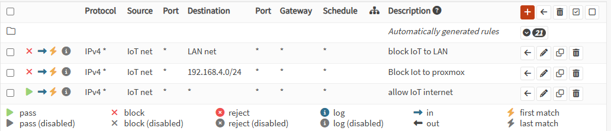
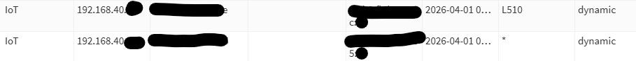
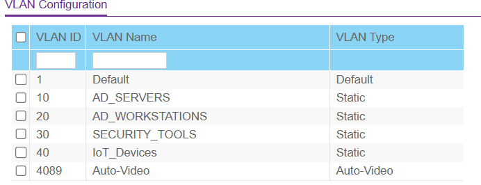
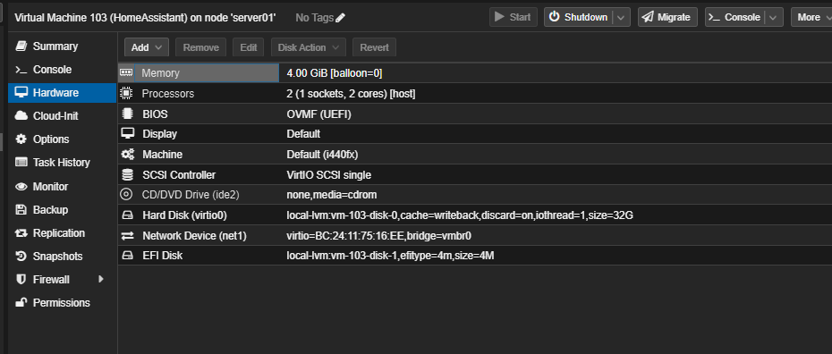
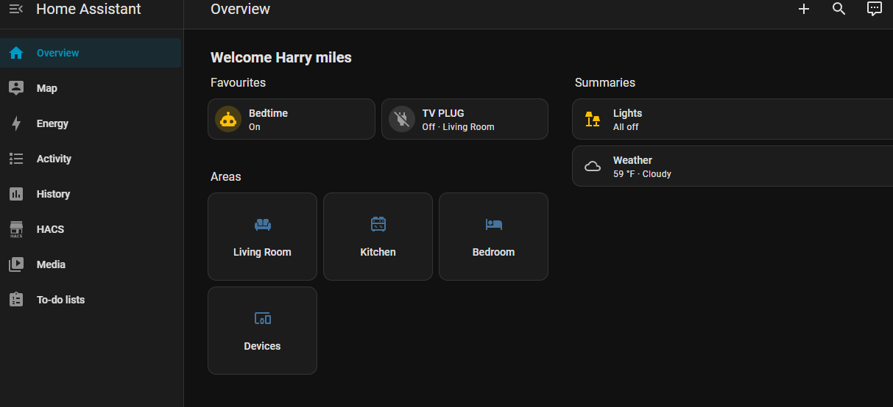
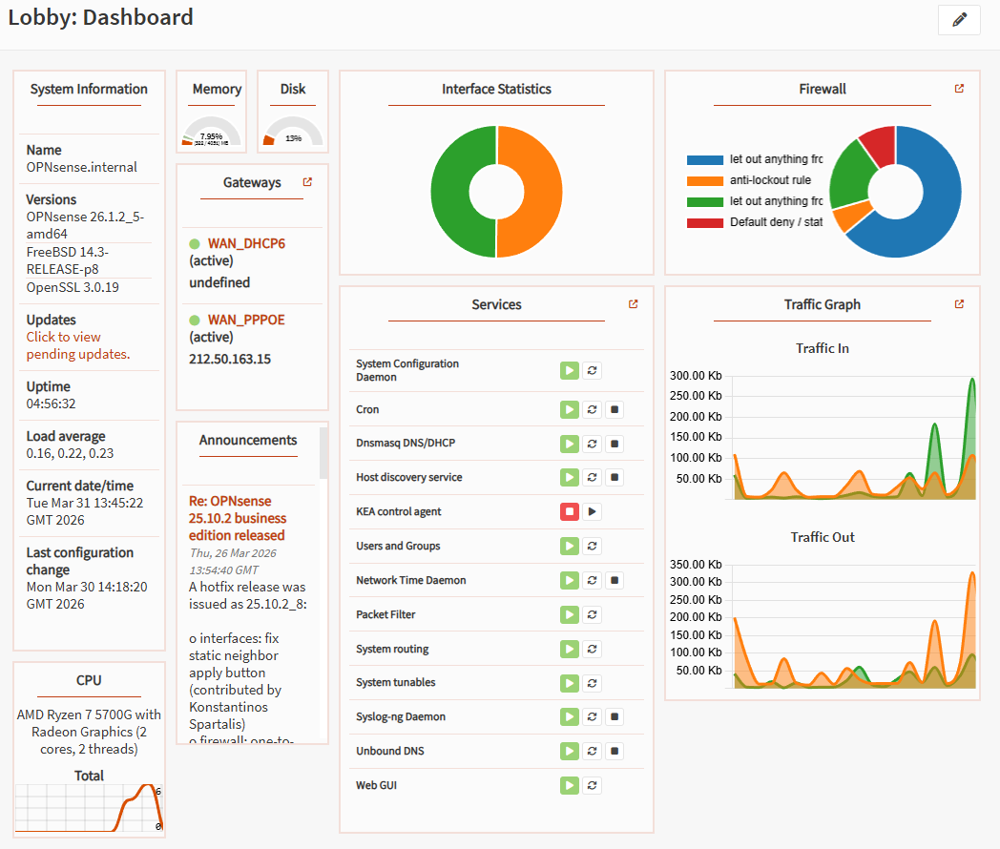

# Lab 00C: Virtualised Firewall & Network Segmentation with OPNsense

## Executive Summary

Designed and deployed a production-grade virtualised network infrastructure, replacing a consumer ISP router with an OPNsense firewall running on Proxmox VE. The project delivered complete ownership of the network stack - routing, stateful firewalling, DHCP, DNS resolution, VLAN segmentation, and PPPoE WAN authentication - all managed from a single hypervisor node. IoT devices are isolated on a dedicated VLAN with firewall-enforced network boundaries, while Home Assistant integrates across segments via targeted firewall policy.

**Duration:** 8+ hours across multiple sessions | **Role:** Network / Infrastructure Engineer | **Tools:** OPNsense 26.1.2, Proxmox VE 9.1.4, Netgear GS510TLP, Home Assistant OS 17.1

---

## Technical Architecture

### Infrastructure Overview

```
                    KCOM FTTP ONT
                         │
                         │ Fibre
                         │
              ┌──────────▼──────────┐
              │     server01        │
              │   Proxmox VE 9.1.4  │
              │  AMD Ryzen 7 5700G  │
              │      32GB RAM       │
              │                     │
              │  ┌───────────────┐  │
              │  │  OPNsense VM  │  │
              │  │  26.1.2       │  │
              │  │               │  │
              │  │ WAN: PPPoE    │──┼──► vmbr1 ──► nic1 ──► ONT
              │  │  (VLAN 101)   │  │
              │  │               │  │
              │  │ LAN:          │──┼──► vmbr2 ──► nic2 ──► Switch
              │  │ 192.168.4.1   │  │        (VLAN aware)
              │  │               │  │
              │  │ IoT (VLAN 40) │  │
              │  │ 192.168.40.1  │  │
              │  └───────────────┘  │
              │                     │
              │  ┌───────────────┐  │
              │  │ Home Assistant│  │
              │  │  OS 17.1      │──┼──► vmbr0 (LAN, 192.168.4.158)
              │  └───────────────┘  │
              │                     │
              │  Proxmox mgmt ──────┼──► vmbr0 (192.168.4.10)
              └─────────────────────┘
                         │
              ┌──────────▼──────────┐
              │  Netgear GS510TLP   │
              │  g2: Trunk (VLANs)  │
              │  g6: VLAN 40 access │
              └──────────┬──────────┘
                    ┌────┴────┐
              ┌─────▼───┐ ┌──▼────────┐
              │ Eero 6+  │ │ Eero 6+   │
              │ Main WiFi│ │ IoT WiFi  │
              └──────────┘ └───────────┘
```

### Component Specifications

| Component | Specification | Purpose |
|-----------|--------------|---------|
| **OPNsense 26.1.2** | 2 vCPU, 4GB RAM, 20GB VirtIO | Gateway, firewall, DHCP, DNS, PPPoE |
| **Home Assistant OS 17.1** | 2 vCPU, 4GB RAM, imported qcow2 | Smart home automation with IoT VLAN access |
| **Netgear GS510TLP** | 8-port managed PoE+ switch | 802.1Q VLAN trunking and access ports |
| **KCOM FTTP ONT** | Fibre to the Premises | ISP termination (PPPoE over VLAN 101) |
| **Eero 6+ (x2)** | Mesh WiFi APs in bridge mode | LAN WiFi + dedicated IoT WiFi on VLAN 40 |
| **Raspberry Pi 1** | Proxmox Qdevice | Cluster quorum (192.168.4.36) |

### Network Configuration

| Interface | Subnet | Gateway | VLAN | Service |
|-----------|--------|---------|------|---------|
| WAN | PPPoE (public IP) | ISP | 101 | KCOM FTTP internet |
| LAN | 192.168.4.0/24 | 192.168.4.1 | Native | Production network |
| IoT | 192.168.40.0/24 | 192.168.40.1 | 40 | Isolated IoT devices |

---

## Implementation Phases

### Phase 1: Proxmox Cluster Quorum Recovery (30 minutes)

**Objective:** Restore VM operations on a single node after cluster relocation

The Proxmox cluster was configured as a two-node setup with a Raspberry Pi Qdevice. Relocating the primary node without the second node or Pi left the cluster in a blocked state - `Activity blocked` with insufficient quorum votes.

**Resolution:**
1. Identified quorum state via `pvecm status`
2. Removed stale Qdevice config from `/etc/corosync/corosync.conf`
3. Force-set expected votes: `corosync-quorumtool -e 1`
4. Added `two_node: 1` directive for single-node operation
5. Verified: `Quorate: Yes`

**Key Takeaway:** Cluster quorum blocks all VM operations including start, stop, and migration. Single-node recovery must be planned before any infrastructure relocation.



---

### Phase 2: OPNsense Deployment & pfSense Pivot (60 minutes)

**Objective:** Deploy a virtualised firewall with dedicated WAN and LAN interfaces

**pfSense to OPNsense Decision:**
pfSense CE was the original choice, but the installer now requires mandatory Netgate account registration - an online check during installation that blocks offline and virtualised deployments. OPNsense 26.1.2 installed cleanly with no external dependencies.

**VM Configuration:**
- BIOS: OVMF (UEFI) - **mandatory**, SeaBIOS hangs during OPNsense boot
- Disk: 20GB VirtIO Block with writeback cache, discard, and IO thread enabled
- Network: net0 → vmbr1 (WAN), net1 → vmbr2 (LAN)
- ZFS installer used after UFS partition destroy failure

**Critical Proxmox requirement:** The LAN bridge (vmbr2) must be VLAN aware to pass 802.1Q tagged traffic from the switch. Without this, VLAN frames are silently dropped at the bridge level.



---

### Phase 3: KCOM PPPoE over VLAN 101 (90 minutes)

**Objective:** Establish internet via KCOM's non-standard PPPoE configuration

KCOM (Hull's fibre ISP) requires PPPoE authentication to occur on VLAN 101, not the raw physical interface. This is the single most undocumented aspect of running your own router on KCOM fibre.

**Configuration:**
1. Created VLAN interface on `vtnet0` with tag `101`
2. Configured PPPoE device using VLAN interface (`vtnet0.101`) as link
3. Entered KCOM credentials (format: `kcoma[account]w[suffix]`)
4. Assigned WAN to PPPoE device

**Failure Mode:** Without VLAN 101, the physical WAN link shows as up, PPPoE sends PADI (initiation) packets, but the ISP never responds with PADO - the session silently fails with no error message.

**Diagnostic Approach:**
```bash
# Monitor PPPoE negotiation on VLAN interface
tcpdump -i vtnet0.101 -n pppoe
# Expected: PADI → PADO → PADR → PADS
# Without VLAN 101: PADI only, no PADO response
```


---

### Phase 4: LAN, DHCP & DNS (45 minutes)

**Objective:** Configure OPNsense as the authoritative network gateway

**LAN Setup:**
- Interface: `vtnet1` → vmbr2
- IP: `192.168.4.1/24` (matched existing subnet - zero device reconfiguration)

**DHCP Discovery: Kea vs Dnsmasq**

Kea DHCP was configured first but failed to respond to DHCP Discover packets on VLAN subinterfaces. Diagnosis via tcpdump confirmed packets arriving at OPNsense but no DHCP Offer in response. Switching to Dnsmasq resolved the issue immediately with no additional configuration.

```bash
# Diagnostic: DHCP traffic on IoT VLAN
tcpdump -i vlan0.40 port 67 or port 68
# Kea: DHCP Discover visible, no Offer sent
# Dnsmasq: Full DORA handshake within seconds
```

**DNS:** Unbound resolver with DNSSEC enabled, forwarding to 1.1.1.1 and 8.8.8.8.



---

### Phase 5: IoT VLAN Isolation (60 minutes)

**Objective:** Create a fully isolated network segment for IoT devices

**Design Principle:** IoT devices must have internet access for cloud services but must not be able to reach any device on the LAN or Proxmox management network. Home Assistant (on LAN) needs one-way access to IoT devices for automation control.

**VLAN Architecture:**
- VLAN 40 on `vtnet1` → `192.168.40.0/24`
- DHCP via Dnsmasq: `192.168.40.100–200`
- Dedicated Eero 6+ as IoT WAP in bridge mode on switch port g6 (untagged VLAN 40, PVID 40)

**Firewall Policy (IoT Interface):**

| Priority | Action | Source | Destination | Purpose |
|----------|--------|--------|-------------|---------|
| 1 | Block | IoT net | LAN net | Prevent IoT → LAN |
| 2 | Block | IoT net | 192.168.4.0/24 | Prevent IoT → Proxmox mgmt |
| 3 | Pass | IoT net | any | Allow IoT → internet |

**Firewall Policy (LAN Interface):**

| Action | Source | Destination | Purpose |
|--------|--------|-------------|---------|
| Pass | 192.168.4.0/24 | 192.168.40.0/24 | HA → IoT for automation |

**Rule order is critical** - OPNsense evaluates top-to-bottom, first match wins. Placing the pass-any rule above the block rules would defeat the entire isolation design.

**Switch Configuration:**
- Port g2 (OPNsense uplink): Tagged VLANs 10, 20, 30, 40 with PVID 1
- Port g6 (IoT Eero): Untagged VLAN 40 with PVID 40







---

### Phase 6: Home Assistant Integration (45 minutes)

**Objective:** Deploy Home Assistant OS with cross-VLAN access to IoT devices

Home Assistant OS 17.1 was deployed as a Proxmox VM using the official qcow2 image. Key requirements:
- OVMF (UEFI) BIOS - SeaBIOS will not boot HAOS
- EFI disk added for UEFI boot support
- Imported qcow2 disk attached as VirtIO Block

```bash
# Import HAOS disk
qm importdisk <VMID> /var/lib/vz/images/haos_ova-17.1.qcow2 local-lvm
```

HA sits on the LAN at `192.168.4.158` and reaches IoT devices at `192.168.40.x` via the OPNsense LAN firewall rule. No dual-homing or second NIC needed - the firewall handles cross-VLAN access cleanly.





---

### Phase 7: Validation (30 minutes)

**Objective:** Verify isolation, connectivity, and service operation

**Isolation Verification:**

| Test | Expected | Actual |
|------|----------|--------|
| IoT → 192.168.4.10 (Proxmox) | Blocked | Blocked |
| IoT → 192.168.4.1 (Gateway) | Pass | Pass |
| IoT → 8.8.8.8 (Internet) | Pass | Pass |
| IoT → 192.168.4.158 (HA) | Blocked | Blocked |
| HA → 192.168.40.x (IoT devices) | Pass | Pass |
| LAN → Internet | Pass | Pass |



---

## Key Learnings & Challenges

### Technical Insights

1. **KCOM PPPoE over VLAN 101** - Undocumented ISP requirement. Without the VLAN tag, PPPoE authentication silently fails with no error. Diagnosed via tcpdump monitoring PPPoE negotiation.

2. **pfSense CE registration requirement** - The installer now mandates a Netgate account check during setup. Not viable for offline or virtualised installs. OPNsense is the better choice for self-hosted infrastructure.

3. **Kea DHCP on VLAN subinterfaces** - Kea does not respond to DHCP Discover packets on VLAN subinterfaces. Confirmed via tcpdump. Dnsmasq works immediately with identical configuration.

4. **VLAN-aware bridges in Proxmox** - The LAN bridge (vmbr2) must be explicitly set to VLAN aware. Without it, 802.1Q tagged frames from the managed switch are silently dropped at the bridge layer - no error, no log entry.

5. **UEFI requirement** - Both OPNsense and Home Assistant OS require OVMF (UEFI) in Proxmox. SeaBIOS causes hangs during boot for both.

### Challenges Encountered

1. **Proxmox cluster quorum** - Relocating a single node from a two-node cluster blocked all VM operations. Required manual corosync configuration to restore single-node quorum.

2. **PPPoE silent failure** - KCOM's VLAN 101 requirement is not documented in any homelab guide. The failure mode is completely silent - link up, no session. Only identifiable via packet capture.

3. **DHCP server selection** - Kea DHCP appeared functional on the main LAN but failed on VLAN subinterfaces. This was a significant time sink before switching to Dnsmasq.

4. **Home Assistant HAOS import** - The qcow2 import requires specific Proxmox steps (importdisk, disk attach, boot order change, EFI disk creation) that aren't immediately obvious from the HA documentation.

### Infrastructure Skills Demonstrated

- Virtualised firewall deployment and management
- ISP PPPoE configuration with non-standard VLAN requirements
- VLAN segmentation on managed switches (802.1Q)
- DHCP and DNS server configuration and troubleshooting
- Firewall rule design with correct evaluation order
- Proxmox cluster management and quorum recovery
- Network troubleshooting via packet capture (tcpdump)
- Cross-VLAN access policy for application integration
- qcow2 disk import and UEFI VM configuration

---

## Portfolio Highlights

**Demonstrable Skills:**

- Replaced consumer ISP router with self-managed virtualised firewall
- Configured PPPoE WAN authentication with ISP-specific VLAN tagging
- Designed and implemented VLAN-based IoT isolation with targeted cross-VLAN access
- Deployed 802.1Q trunk and access ports on managed switch infrastructure
- Managed Proxmox cluster quorum recovery during infrastructure relocation
- Integrated Home Assistant smart home platform with network-separated IoT devices
- Diagnosed and resolved DHCP, PPPoE, and VLAN issues using packet capture analysis

**Architecture Decisions:**
- All network services virtualised on single hypervisor for management simplicity
- IoT isolation through VLAN + firewall rules - three rules in correct order
- Home Assistant reaches IoT via targeted firewall policy, not network adjacency
- Dedicated physical NICs per function (management, WAN, LAN) - no shared interfaces

**Quantifiable Outcomes:**
- 3 network segments managed by single OPNsense instance
- 100% IoT isolation verified - zero unauthorised cross-VLAN traffic
- PPPoE uplink established after resolving undocumented VLAN 101 requirement
- Cluster quorum restored within 30 minutes of identifying the issue
- Full network stack migrated from consumer router with zero device reconfiguration (subnet preserved)

---

## Future Enhancements

1. **Second Proxmox node (Dell T3300)** - Restore two-node cluster with proper Qdevice quorum
2. **Tapo smart device integration** - Smart plugs and bulbs via HACS Tapo Controller in Home Assistant
3. **Additional VLANs** - Guest WiFi network
4. **WireGuard VPN** - Remote access to homelab through OPNsense
5. **IDS/IPS** - Suricata on OPNsense with log forwarding to Splunk

---

## References & Resources

**Official Documentation:**
- [OPNsense Documentation](https://docs.opnsense.org/)
- [OPNsense PPPoE Configuration](https://docs.opnsense.org/manual/how-tos/IPv4_PPPoE.html)
- [Proxmox VE Network Configuration](https://pve.proxmox.com/wiki/Network_Configuration)
- [Netgear GS510TLP Support](https://www.netgear.com/support/product/GS510TLP)
- [Home Assistant OS Installation](https://www.home-assistant.io/installation/alternative/)

**Related Labs:**
- [Lab 00: Network Foundation Setup](../00_Network_Setup/) - Original flat network
- [Lab 00B: Network Enhancement with VLANs](../00B_Network_Enhancement/) - VLAN groundwork
- [Lab 01: Splunk SIEM Deployment](../01_Splunk_SIEM_Lab/) - Future OPNsense log integration

---

## Project Metadata

**Author:** Harry Miles
**GitHub Repository:** [hazzugot/HomelabRYZEN](https://github.com/hazzugot/HomelabRYZEN)
**Lab Number:** 00C - Virtualised Firewall & Network Segmentation with OPNsense
**Completion Date:** 2026-03-31
**Environment:** Proxmox VE 9.1.4, OPNsense 26.1.2, Netgear GS510TLP, Home Assistant OS 17.1
**Total Project Time:** 8+ hours (multiple sessions)

**Tags:** #OPNsense #Firewall #VLAN #IoT #NetworkSegmentation #Proxmox #HomeAssistant #PPPoE #Infrastructure #Homelab

---

## Contact & Collaboration

For questions, feedback, or collaboration opportunities:
- **GitHub:** [hazzugot](https://github.com/hazzugot)
- **LinkedIn:** [Harry Miles](https://www.linkedin.com/in/harry-miles-18ab53234)
- **TryHackMe:** [hazmiles11](https://tryhackme.com/p/hazmiles11)

**Open to:**
- Technical reviews and infrastructure feedback
- Collaboration on virtualised infrastructure and Blue Team projects
- Infrastructure / SOC Analyst opportunities

---

*This documentation represents real-world, hands-on experience with virtualised network infrastructure and is maintained as part of a professional portfolio.*
