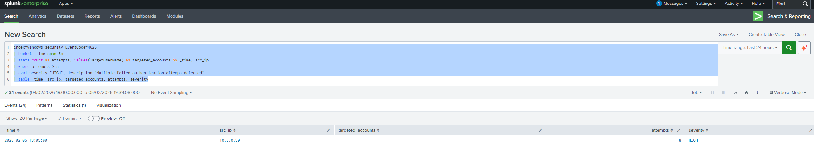
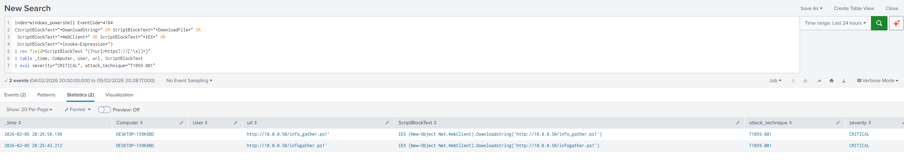

# Lab 01: Enterprise SIEM Deployment with Splunk

**Status:** Complete | **Difficulty:** Beginner-Intermediate | **Time:** 6 hours

Deployed Splunk Enterprise as a centralised SIEM to collect endpoint telemetry, detect attack techniques, and build SOC monitoring dashboards. Simulated real-world attacks from Kali Linux and validated detection coverage against MITRE ATT&CK.

---

## Architecture

```
Proxmox Hypervisor (AMD Ryzen 7 5700G | 32GB RAM)
 |
 +-- Splunk Server (Ubuntu 22.04) --- 10.0.0.10
 |     Web UI :8000 | Receiver :9997
 |
 +-- Windows Victim (Win 11 + Sysmon) --- 10.0.0.20
 |     Universal Forwarder --> Splunk
 |
 +-- Kali Linux (Attack Box) --- 10.30.0.50
       Nmap | Hydra | Mimikatz | Custom payloads
```

## Attack Scenarios & Detections

| Attack | MITRE ATT&CK | Detection | MTTD |
|--------|-------------|-----------|------|
| Network recon (Nmap) | T1046 | Sysmon EventCode 3 - high port density | <2 min |
| RDP brute force (Hydra) | T1110.001 | EventCode 4625 - 5+ failures in 5 min | <30 sec |
| PowerShell download cradle | T1059.001 | EventCode 4104 - script block logging | <15 sec |
| Credential dumping (Mimikatz) | T1003.001 | Sysmon EventCode 10 - LSASS access | Immediate |

## Screenshots

| Component | Evidence |
|-----------|----------|
| Splunk deployment |  |
| Endpoint telemetry |  |
| Brute force detection |  |
| PowerShell detection |  |
| LSASS credential dump |  |
| SOC dashboard |  |
| MITRE ATT&CK coverage |  |

## Key Outcomes

- 4 custom detection rules mapped to MITRE ATT&CK
- 100% detection rate across all simulated attacks
- 6-panel SOC monitoring dashboard
- Full incident investigation workflow documented
- Splunk SPL queries for threat hunting

## Skills Demonstrated

- Splunk Enterprise deployment and configuration
- Windows security log collection (Sysmon, EventLog, PowerShell)
- Detection engineering and SPL query development
- Attack simulation and red team validation
- SOC dashboard design
- MITRE ATT&CK framework mapping
- Incident response workflows


## Built With

- Splunk Enterprise 9.x (Free License)
- Splunk Universal Forwarder
- Sysmon (SwiftOnSecurity config)
- Windows 11 Enterprise
- Kali Linux
- Proxmox VE 8.x

---

**Previous:** [Lab 00B - Network Segmentation](../00B_Network_Enhancement/) | **Next:** [Lab 02 - Active Directory](../02_Active_Directory_Lab/)
